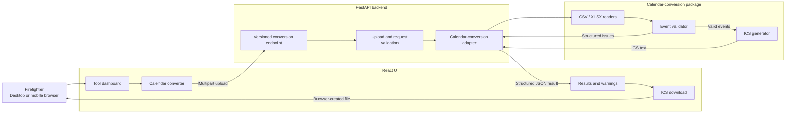
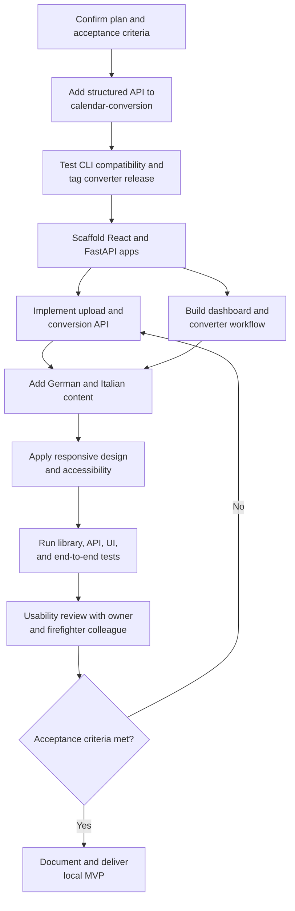

# Feuerwehr Tools — Implementation Plan

## Summary

Replace `PLANS.md` entirely with a decision-complete plan for a local, bilingual web application named **Feuerwehr Tools**.

The MVP will:

- Run only on `127.0.0.1` (`localhost`), so the application is accessible from this computer but not from other devices on the local network or the public internet.
- Support desktop and responsive mobile layouts.
- Use German by default, with an Italian language switch.
- Present a tool dashboard prepared for future programs.
- Let users upload XLSX or CSV schedules, convert them, review skipped events, and download an ICS calendar.
- Retain neither uploads nor generated calendars after the request.
- Include inline guidance and a downloadable example schedule.

## Architecture and Interfaces



- Build a React, TypeScript, and Vite frontend with React Router, i18n translation dictionaries, component tests, and project-owned CSS design tokens.
- Build a Python FastAPI backend using Pydantic, Uvicorn, and multipart upload support.
- Use Vite’s API proxy during development. For the local packaged build, FastAPI serves the compiled frontend and API from one origin.
- Organize the repository around `frontend/`, `backend/`, sample assets, shared developer commands, tests, and setup documentation.
- Provide `make setup`, `make dev`, `make test`, and `make run` workflows. Initialize Git and add suitable Python, Node, editor, generated-file, and upload-artifact exclusions.

### Calendar-conversion library

Add a public service layer to the calendar-conversion project and release/tag it before integrating it:

```python
convert_schedule(
    source: BinaryIO,
    *,
    filename: str,
    calendar_name: str,
) -> ConversionResult
```

`ConversionResult` exposes ICS text, total/converted/skipped counts, and invalid events. Each invalid event includes its source position, ID, summary, and structured issue codes. Fatal input errors expose a stable code plus optional row and worksheet locations.

Preserve the converter’s existing CLI behavior and exit codes by making the CLI call this new service. Pin the backend to the `calendar-conversion` `v0.2.0` Git tag; allow an editable sibling checkout during development.

### Web API

Implement `POST /api/v1/tools/calendar-converter/convert` with one multipart `file` field:

- Accept `.xlsx` and `.csv` files up to 10 MiB.
- Validate the extension, size, and readable file structure.
- Return JSON containing `status`, counts, invalid-event details, and a nullable calendar object with filename and UTF-8 ICS content.
- Use `success` when all events convert, `partial` when valid and invalid events coexist, and `failure` when no event can be converted.
- Return `413` for oversized uploads, `415` for unsupported types, `422` for malformed schedules, and a generic localized-safe `500` response for unexpected failures.
- Use stable error codes for frontend translation; never expose tracebacks.
- Do not persist or log uploaded content. Sanitize filenames and bind the production-like local server only to `127.0.0.1`.

React will create a `text/calendar;charset=utf-8` Blob from the returned ICS text and initiate the download locally.

## User Experience

- Use a calm civic style: warm off-white background, charcoal text, restrained fire-red accents, green success, amber warning, system fonts, WCAG AA contrast, visible focus states, and touch targets of at least 44 px.
- Keep **Feuerwehr Tools** as the brand in both languages.
- Provide a header with brand, German/Italian switch, and simple navigation.
- Default to German and persist an explicit language choice locally.
- Show a dashboard with one calendar-converter card; future programs become additional cards without changing the shell.
- Give the converter five explicit states: idle, file selected, converting, success/partial result, and fatal error.
- Support both file picker and drag-and-drop, while keeping the picker fully usable by keyboard and touch.
- Explain accepted formats and the three-step workflow beside the upload control.
- Include one version-controlled example XLSX schedule using the converter’s required columns.
- On partial conversion, prominently explain that invalid events were skipped, list each skipped event and its problems, and retain the ICS download button.
- If all events are invalid, show the problems but offer no empty calendar download.
- Prevent duplicate submissions and provide clear reset/choose-another-file actions.

## Implementation Workflow



1. Add the structured conversion service, typed results/errors, compatibility tests, documentation, and release tag to calendar-conversion.
2. Scaffold the React and FastAPI applications, shared commands, configuration, Git metadata, and local development proxy.
3. Implement the upload endpoint, converter adapter, size/type validation, response models, security-safe error handling, and sample-file delivery.
4. Build the responsive dashboard and converter workflow with German and Italian translations.
5. Apply the design system, accessibility behavior, partial-result presentation, calendar download, and inline help.
6. Add automated tests, production frontend serving, localhost launch workflow, and setup/troubleshooting documentation.
7. Conduct manual usability testing with the project owner and at least one representative firefighter colleague; revise wording or interaction problems before declaring the MVP complete.

## Test Plan and Acceptance Criteria

- Converter tests cover valid CSV/XLSX, partial conversion, all-invalid input, malformed rows, duplicate IDs, unsupported extensions, and unchanged CLI exit/report behavior.
- API tests cover success, partial and failure payloads, 10 MiB enforcement, malformed uploads, filename sanitization, Unicode, and absence of retained files.
- Frontend tests cover routing, both languages, upload validation, state transitions, issue rendering, partial download, reset behavior, and persisted language choice.
- End-to-end tests cover dashboard-to-download flows for valid, partially valid, malformed, and all-invalid sample files.
- Accessibility checks cover keyboard-only use, focus order, semantic labels, screen-reader announcements, contrast, zoom, and phone-sized layouts.
- The downloaded ICS must contain only valid events and import successfully into a mainstream calendar application.
- The final local build must start through the documented command, remain accessible only from the same computer, and require no internet connection after dependencies are installed.

## Assumptions and Later Roadmap

- The MVP has no accounts, database, analytics, background jobs, or server-side file history.
- A human-authored schedule is small enough for synchronous conversion and JSON delivery.
- Internet publication is a separate phase requiring explicit decisions about hosting, authentication, authorization, TLS, rate limiting, privacy, monitoring, retention, and deployment.
- Additional programs will follow the dashboard-card pattern and receive their own versioned API routes and backend adapters.
- Offline/PWA support, browser-based schedule editing, event preview, and local-network access are outside the MVP.
