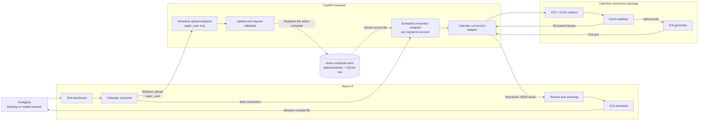
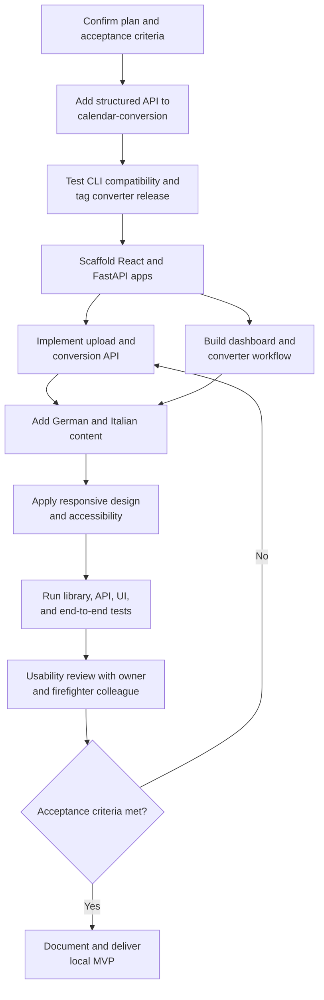

# Feuerwehr Tools — Implementation Plan

## Summary

Replace `PLANS.md` entirely with a decision-complete plan for a local, bilingual web application named **Feuerwehr Tools**.

The MVP will:

- Run only on `127.0.0.1` (`localhost`), so the application is accessible from this computer but not from other devices on the local network or the public internet.
- Support desktop and responsive mobile layouts.
- Use German by default, with an Italian language switch.
- Present a tool dashboard prepared for future programs.
- Let a `super_user` upload an XLSX or CSV schedule that becomes the single active schedule held by the server.
- Let every signed-in account convert that stored schedule and download an ICS calendar; only a `super_user` reviews skipped events.
- Retain exactly one active source schedule in a git-ignored store outside the served tree, and retain no generated calendar.
- Include inline guidance, and offer the downloadable example schedule to the `super_user` accounts that supply one.

## Architecture and Interfaces



- Build a React, TypeScript, and Vite frontend with React Router, i18n translation dictionaries, component tests, and project-owned CSS design tokens.
- Build a Python FastAPI backend using Pydantic, Uvicorn, and multipart upload support.
- Persist application accounts in a local SQLite database through SQLAlchemy, and authenticate them with a signed session cookie. Roles gate behavior: `super_user` accounts may upload schedules; `user` accounts may only use read-only tool features.
- Use Vite’s API proxy during development. For the local packaged build, FastAPI serves the compiled frontend and API from one origin.
- Organize the repository around `frontend/`, `backend/`, sample assets, shared developer commands, tests, and setup documentation.
- Provide `make setup`, `make dev`, `make test`, and `make run` workflows. Initialize Git and add suitable Python, Node, editor, generated-file, and upload-artifact exclusions.

### Calendar-conversion library

Add a public service layer to the calendar-conversion project and release/tag it before integrating it:

```python
convert_schedule(
    source: BinaryIO,
    *,
    filename: str,
    calendar_name: str,
) -> ConversionResult
```

`ConversionResult` exposes ICS text, total/converted/skipped counts, and invalid events. Each invalid event includes its source position, ID, summary, and structured issue codes. Fatal input errors expose a stable code plus optional row and worksheet locations.

Preserve the converter’s existing CLI behavior and exit codes by making the CLI call this new service. Pin the backend to the `calendar-conversion` `v0.2.0` Git tag; allow an editable sibling checkout during development.

### Web API

Implement `POST /api/v1/tools/calendar-converter/convert` with one multipart `file` field:

- Accept `.xlsx` and `.csv` files up to 10 MiB.
- Validate the extension, size, and readable file structure.
- Return JSON containing `status`, counts, invalid-event details, and a nullable calendar object with filename and UTF-8 ICS content.
- Use `success` when all events convert, `partial` when valid and invalid events coexist, and `failure` when no event can be converted.
- Return `413` for oversized uploads, `415` for unsupported types, `422` for malformed schedules, and a generic localized-safe `500` response for unexpected failures.
- Use stable error codes for frontend translation; never expose tracebacks.
- Never log uploaded content. Sanitize filenames and bind the production-like local server only to `127.0.0.1`.
- Require a `super_user` session for `POST .../convert`; return `401` with a stable `not_authenticated` code when unauthenticated and `403` with `forbidden` when the session is a plain `user`. This endpoint converts in memory, persists nothing, and is retained as a stateless API with no UI caller.

Three further endpoints operate on the server-held schedule:

- `PUT /api/v1/tools/calendar-converter/schedule` accepts one multipart `file` from a `super_user` and replaces the active schedule. It reuses the same validation as `.../convert` (extension allow-list, 10 MiB ceiling, filename sanitization) and returns the stored schedule's public metadata.
- `GET /api/v1/tools/calendar-converter/schedule` returns that metadata to any signed-in account, or `{"schedule": null}` when nothing is stored. An empty store is a normal state, not an error.
- `POST /api/v1/tools/calendar-converter/schedule/convert` converts the stored schedule for any signed-in account and returns the same `ConversionResponse` contract as `.../convert`. It returns `409` with the stable `no_active_schedule` code when the store is empty.

React will create a `text/calendar;charset=utf-8` Blob from the returned ICS text and initiate the download locally.

### Users and access control

Store accounts in a local SQLite database (`data/firefighter.db` by default, overridable with `FIREFIGHTER_TOOLS_DATABASE_URL`) through SQLAlchemy models kept separate from the Pydantic API contract. Each account has a `username`, a scrypt password hash (stdlib `hashlib.scrypt`, never logged), a `role` of `super_user` or `user`, the firefighter profile fields `name`, `surname`, `rank`, `zug`, and `gruppe`, and an optional `personnel_number`.

- The `personnel_number` is unique across accounts (a unique index, so any number of accounts may have none) and limited to 1–50 letters, digits, `.`, `_`, or `-`, so it can never contain a schedule's participant separators or a path character. It is the id a schedule's `participants` column refers to, and `GET /api/v1/auth/me` exposes it to its own account.
- The schema is owned by Alembic migrations in `backend/src/firefighter_tools_backend/db/migrations/`, configured in code so the URL always comes from the application settings. Every process that opens the database (the server and each account command) upgrades it to the latest revision on start. Revision `0001_baseline` reproduces the schema `Base.metadata.create_all` built before migrations existed; a database from that era has no `alembic_version` table, so it is stamped at the baseline and then upgraded in place, keeping its accounts. `0002_personnel_number` adds the personnel number. Future schema changes are new revisions, never edits to `create_all`.

- Authenticate with Starlette's signed session cookie (`itsdangerous`), keyed from `FIREFIGHTER_TOOLS_SECRET_KEY` with a development-only fallback. The cookie carries only the account id.
- `POST /api/v1/auth/login` verifies credentials and starts the session; `POST /api/v1/auth/logout` clears it; `GET /api/v1/auth/me` returns the signed-in account without secrets. Failures use stable codes (`invalid_credentials`, `not_authenticated`, `forbidden`) and never expose tracebacks.
- `super_user` accounts may upload schedules through the converter, replace the server-held active schedule, and download the example schedule that shows the required columns; every signed-in account may convert the active schedule and download the resulting calendar.
- Create and manage accounts with the `python -m firefighter_tools_backend create-user` command (which accepts `--personnel-number`) and assign, replace, or clear a number with `set-personnel-number`; the database file and `.env` are git-ignored and never committed.
- This does not change the deployment posture: the server still binds `127.0.0.1` only, and internet publication (TLS, rate limiting, session hardening) remains a separate later phase.

### Schedule store

The server holds exactly one active schedule, replaced rather than versioned.

- Files live in `data/schedules/` by default, overridable with `FIREFIGHTER_TOOLS_SCHEDULE_STORE`. The directory is git-ignored through the existing `data/` rule and sits outside the served tree, so a stored schedule is never reachable as a static asset.
- The on-disk name is an opaque `<uuid4hex>.<csv|xlsx>`. The uploaded filename never reaches the filesystem, so path traversal is structurally impossible; the sanitized original is kept only in the database and is what names the downloaded `.ics`.
- The singleton `active_schedule` table row is the source of truth. Writes go to a temporary file that is `fsync`ed and then atomically renamed, the row is committed, and only afterwards is every file the row does not name purged. A crash at any point therefore leaves at most a harmless orphan, which the next upload removes.
- The reverse failure self-heals: when the row names a file that no longer exists, the read path deletes the row and reports an empty store, so `GET .../schedule` and `POST .../schedule/convert` can never disagree.
- SQLite does not preserve timezone offsets, so stored timestamps are re-attached to UTC when read.
- Generated calendars are still never written to disk. `scripts/verify.py` asserts the default store stays under `data/`, holds no `.ics`, and contains only opaque `<uuid>.<csv|xlsx>` files.
- Deleting the active schedule through the API, per-user filtering of commitments, and schedule history are future work. Any schema change they need is a new Alembic revision (see Users and access control).

## User Experience

- Use a calm civic style: warm off-white background, charcoal text, restrained fire-red accents, green success, amber warning, system fonts, WCAG AA contrast, visible focus states, and touch targets of at least 44 px.
- Keep **Feuerwehr Tools** as the brand in both languages.
- Provide a header with brand, German/Italian switch, and simple navigation.
- Default to German and persist an explicit language choice locally.
- Show a dashboard with one calendar-converter card; future programs become additional cards without changing the shell.
- Give the converter five explicit states: idle, file selected, converting, success/partial result, and fatal error.
- Support both file picker and drag-and-drop, while keeping the picker fully usable by keyboard and touch.
- Explain accepted formats and the three-step workflow beside the upload control.
- Include one version-controlled example XLSX schedule using the converter’s required columns.
- On partial conversion, prominently explain that invalid events were skipped, list each skipped event and its problems, and retain the ICS download button.
- If all events are invalid, show the problems but offer no empty calendar download.
- Prevent duplicate submissions and provide clear reset/choose-another-file actions.

## Implementation Workflow



1. Add the structured conversion service, typed results/errors, compatibility tests, documentation, and release tag to calendar-conversion.
2. Scaffold the React and FastAPI applications, shared commands, configuration, Git metadata, and local development proxy.
3. Implement the upload endpoint, converter adapter, size/type validation, response models, security-safe error handling, and sample-file delivery.
4. Build the responsive dashboard and converter workflow with German and Italian translations.
5. Apply the design system, accessibility behavior, partial-result presentation, calendar download, and inline help.
6. Add automated tests, production frontend serving, localhost launch workflow, and setup/troubleshooting documentation.
7. Conduct manual usability testing with the project owner and at least one representative firefighter colleague; revise wording or interaction problems before declaring the MVP complete.

## Test Plan and Acceptance Criteria

- Converter tests cover valid CSV/XLSX, partial conversion, all-invalid input, malformed rows, duplicate IDs, unsupported extensions, and unchanged CLI exit/report behavior.
- API tests cover success, partial and failure payloads, 10 MiB enforcement, malformed uploads, filename sanitization, Unicode, and the absence of any retained generated calendar.
- Schedule-store tests cover opaque stored names, replacement that purges the previous file, a failed commit that removes the new file, orphan purging, a self-healing row whose file disappeared, traversal filenames that cannot escape the store, and the `409 no_active_schedule` contract.
- Authentication tests cover login success and failure, session `me`/logout, scrypt hashing that never stores plaintext, `401` for unauthenticated conversion, and `403` for a plain `user`. `GET .../example` stays open to any signed-in account, but the interface offers it only to a `super_user`, because a plain account never supplies a source file.
- Frontend tests cover routing, both languages, upload validation, state transitions, issue rendering, partial download, reset behavior, and persisted language choice.
- End-to-end tests cover dashboard-to-download flows for valid, partially valid, malformed, and all-invalid sample files.
- Accessibility checks cover keyboard-only use, focus order, semantic labels, screen-reader announcements, contrast, zoom, and phone-sized layouts.
- The downloaded ICS must contain only valid events and import successfully into a mainstream calendar application.
- The final local build must start through the documented command, remain accessible only from the same computer, and require no internet connection after dependencies are installed.

## Assumptions and Later Roadmap

- The application has local accounts in a SQLite user store with `super_user` and `user` roles, and holds exactly one active source schedule on the server. It has no analytics, background jobs, schedule history, or retained generated calendars.
- A human-authored schedule is small enough for synchronous conversion and JSON delivery.
- Internet publication is a separate phase requiring explicit decisions about hosting, authentication, authorization, TLS, rate limiting, privacy, monitoring, retention, and deployment.
- Additional programs will follow the dashboard-card pattern and receive their own versioned API routes and backend adapters.
- Offline/PWA support, browser-based schedule editing, event preview, and local-network access are outside the MVP.
